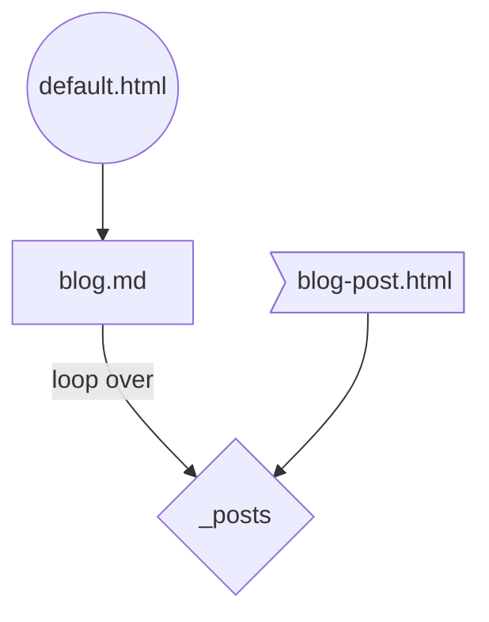
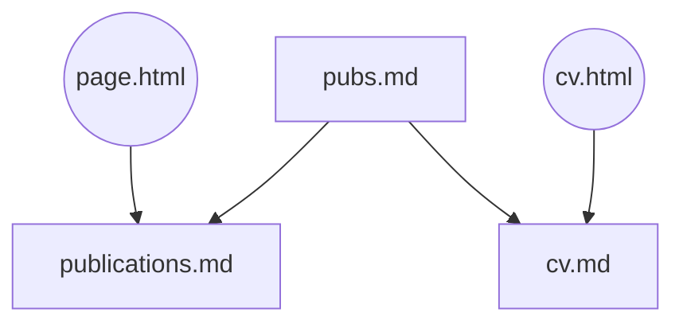
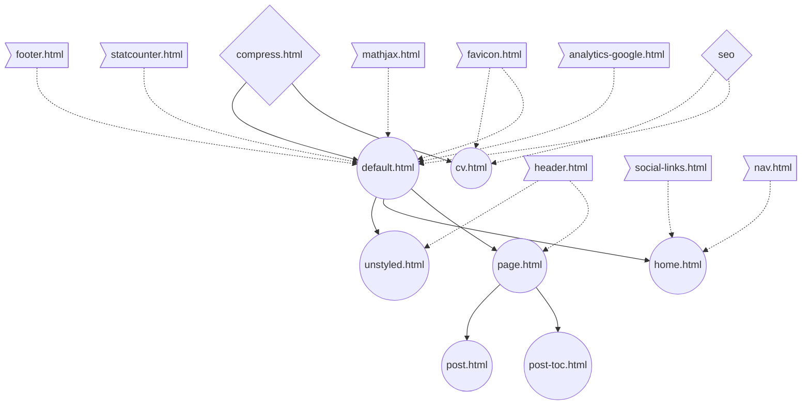

# Personal Website Code

Code for my personal website hosted using [Github Pages](https://pages.github.com/), built using [Jekyll](https://jekyllrb.com/), styled using the [Indigo](https://github.com/sergiokopplin/indigo) theme, with CV generation handled using a [markdown-cv template](https://elipapa.github.io/markdown-cv/).

Open sourced under the [MIT license](https://github.com/ejolly/ejolly.github.io/blob/master/LICENSE.md).

## Development

`bundle install`: install all ruby packages  
`npm run dev`: start local server
`npm run build`: build site to `_site/`

## Cheatsheet

- Create new pages but putting `.html` or `.md` files inside the root of this repo (e.g. `about.md`)
- `_includes` = reusable HTML snippets used within `.md` files or by `.html` files in `_layouts`
- `_layouts` = folder of HTML templates dictating how `.md` files should be processed using the `layout: name` frontmatter
- `assets/css/tailwind.css` = main file with all style classes

## Development

### Legend

### How the post list renders

### How publications work

### Layout dependencies

