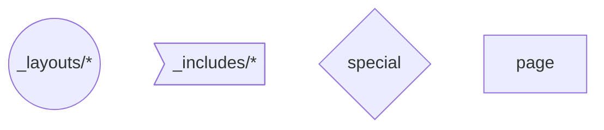
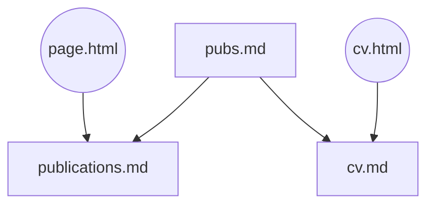
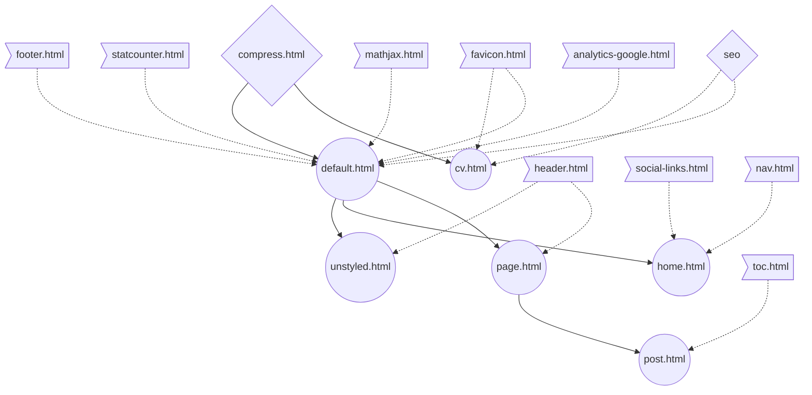

# Personal Website Code

Code for my personal website hosted using [Github Pages](https://pages.github.com/), built using [Jekyll](https://jekyllrb.com/), styled using the [TailwindCSS](https://tailwindcss.com) and [AnimateCSS](https://animate.style/), with CV generation handled using a [markdown-cv template](https://elipapa.github.io/markdown-cv/).

## Development

- `bundle install` install all ruby packages  
- `npm install` install tailwind
- `npm run write` for incremental builds using only files in `_posts`  
- `npm run draft` for incremental builds using files in `_posts` and `_drafts`  
- Both scripts run `jekyll build` once *before* `serve` to "reset" the `--incremental` builds
- `npm run build`: build site to `docs`
- `npm run serve`: check out locally built site
- `npm run deploy-staging`: deploy built site to staging URL using surge.sh

## Cheatsheet

- Create new pages but putting `.html` or `.md` files inside the root of this repo (e.g. `about.md`)
- `_includes` = reusable HTML snippets used within `.md` files or by `.html` files in `_layouts`
- `_layouts` = folder of HTML templates dictating how `.md` files should be processed using the `layout: name` front-matter
- `assets/css/tailwind.css` = main file with all tailwind classes
- `assets/css/global.css` = additional styles *after* Jekyll process markdown
- `assets/css/syntax.css` = code block syntax highlighting generated using `rouge style molokai > assets/css/syntax.css`

## Development

### Legend

### How the post list renders

### How publications work

### Layout dependencies

